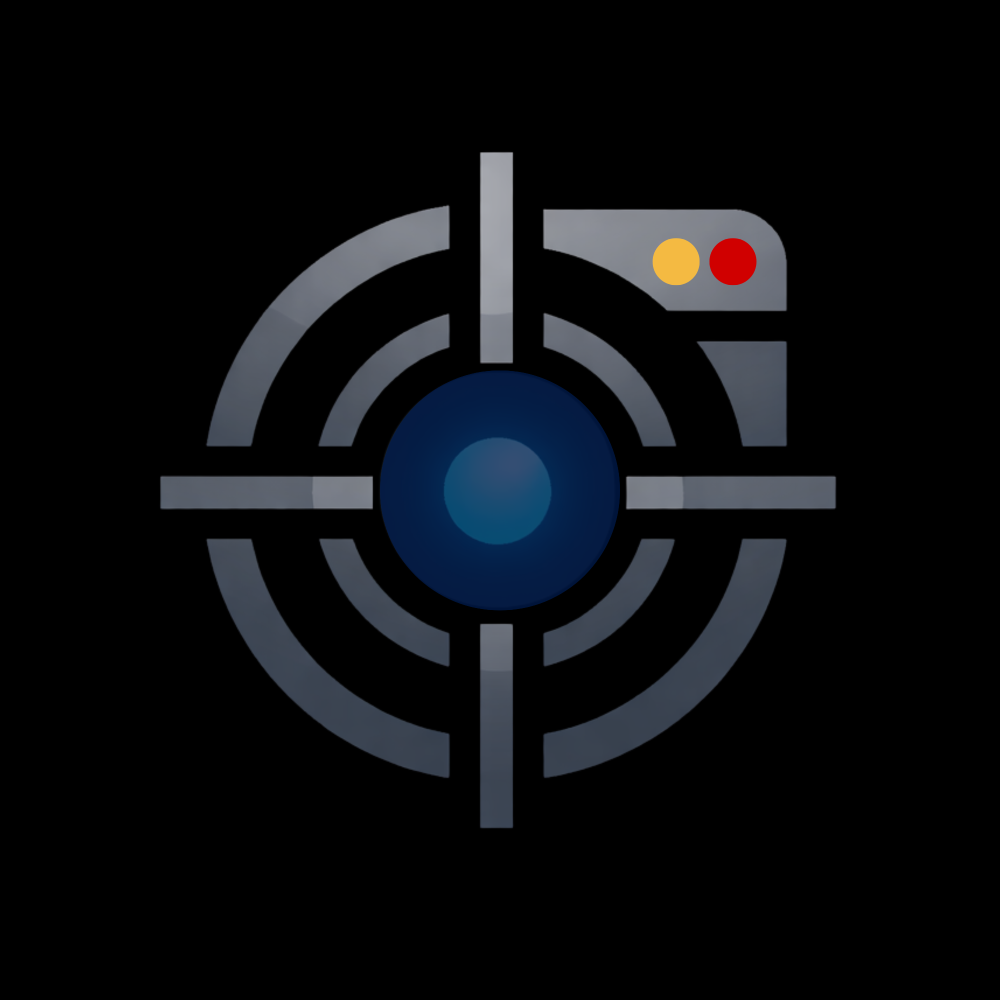
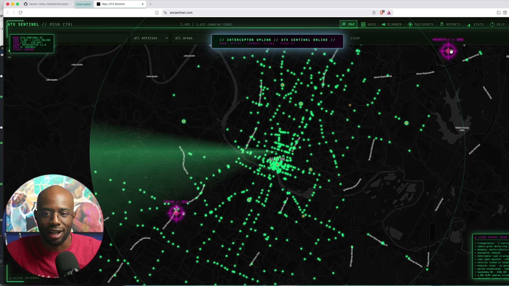

<p align="center">
  
</p>

<h1 align="center">Interceptor</h1>

<p align="center">
  <strong>AI agents use your real browser and macOS apps like a human would.</strong>
</p>

<p align="center">
  No CDP. No separate automated browser. No starting from zero.
</p>

<p align="center">
  <a href="#install-in-60-seconds"><strong>Install</strong></a>
  ·
  <a href="#quick-start"><strong>Quick Start</strong></a>
  ·
  <a href="#the-two-surfaces"><strong>Pick a Surface</strong></a>
  ·
  <a href="#surface-1-interceptor-browser"><strong>Browser</strong></a>
  ·
  <a href="#surface-2-interceptor-macos"><strong>macOS</strong></a>
  ·
  <a href="ARCHITECTURE.md"><strong>Architecture</strong></a>
</p>

<p align="center">
  
  
  
  
</p>


Interceptor gives agents human-style control of the tools you already use — **computer-use** for the native macOS apps on your desktop, **browser-use** for the web apps in your browser. Work happens in both places, so Interceptor meets you in the middle. One CLI, two product surfaces:

- **Interceptor Browser** — runs as a Chrome extension inside your actual browser. Your cookies, sessions, logins, and tabs stay intact. Read pages, click, type, navigate, observe network traffic, automate rich editors, record-and-replay user flows.
- **Interceptor macOS** — runs as a Swift bridge daemon. Drives native macOS apps the same way: structured accessibility trees, OS-level trusted input, on-device vision/speech/NLP, system-wide event monitoring.

The agent calls `interceptor` CLI commands, reads the output, and decides what to do next. No MCP required. No API keys required.

> **Warning**
> Interceptor gives agents real autonomy over your browser and apps. Treat it like an agent, not a toy script runner.

## Why Interceptor Exists

Most browser automation stacks start a separate browser and talk to it through DevTools. That is fine until the site notices, your authenticated context disappears, or your agent has to relearn a workflow from scratch.

Interceptor was built from the opposite premise: use the browser and apps the human is already using, let the agent see what is really happening underneath, and make the workflow reusable after a single live walkthrough.

| Capability | Interceptor | Playwright / Puppeteer / CDP-first tooling |
|---|---|---|
| Uses your existing logged-in browser profile | Yes | Usually no |
| Reads passive fetch/XHR/SSE/WebSocket/sendBeacon/BroadcastChannel using only standard Web APIs | Yes | Partial — typically requires the DevTools protocol |
| Synthetic clicks/keys via `userActivation` override + `__interceptor_trust` event marker for `isTrusted`-gated handlers | Yes | Often requires DevTools-protocol fallback |
| Drives canvas-rendered editors (Docs / Slides / Sheets / map viewers / design tools) without OS keyboard | Yes — dispatched events on the canvas | Usually requires `--os` or OS-level CGEvent |
| Captures native client-side exports (PNG/PDF/SVG) without Save dialog | Yes — `URL.createObjectURL` patch + auto-download suppression | Not built in |
| Records real human sessions and exports replay plans | Yes | Not built in |
| Extends the same CLI to native macOS apps | Yes | No |
| Avoids a separate automated browser by default | Yes | No |

## Demo Preview

[](https://hacker-valley-media.github.io/Interceptor/walkthrough.html)

Click the preview to watch the current walkthrough. It shows the CLI flow and live browser overlays working together in the same session.

## Install In 60 Seconds

Download a signed installer and double-click. macOS does the rest.

Two installers ship per release. Pick the one that matches what you actually need:

| Installer | What it installs | macOS TCC consents | When to pick it |
|---|---|---|---|
| **`Interceptor-Browser-<version>.pkg`** *(recommended default)* | CLI + daemon + extension | **None.** No Screen Recording / Accessibility / Apple Events prompts. | You drive web pages. Web scraping, CI flow tests, browser automation. macOS 11+. |
| **`Interceptor-Full-<version>.pkg`** | All of the above **plus** `interceptor-bridge.app` + LaunchAgent | Screen Recording, Accessibility, Apple Events (per target app, on first dispatch) | You also drive native macOS apps (Finder, Slack, Notes), need on-screen text capture, dispatch keystrokes outside the browser. macOS 14+. |

Both download from the same [Releases](https://github.com/Hacker-Valley-Media/Interceptor/releases) page. Start with **Browser** unless you know you need native macOS commands — you can always upgrade to Full later via `interceptor upgrade --full`.

### Install steps

1. Download the matching `.pkg` from Releases.
2. Double-click it. Walk through the installer (admin password required once).
3. *(Full pkg only)* Open **System Settings → Privacy & Security**. The first time you run `interceptor macos *`, macOS will prompt for **Accessibility**, **Screen Recording**, and **Apple Events** access for `interceptor-bridge` — allow each. The Browser pkg never triggers these prompts.
4. Open a terminal:

```bash
interceptor open "https://example.com"        # browser surface (works in both pkgs)
interceptor macos tree                         # macOS surface (Full pkg only, after Privacy & Security grants)
```

### What each pkg lays down

**Browser pkg** (`Interceptor-Browser-<version>.pkg`):

| Component | Destination |
|---|---|
| `interceptor` CLI | `/usr/local/bin/interceptor` (on `PATH`) |
| Daemon + extension files | `/Library/Application Support/Interceptor/` |
| Chrome + Brave native messaging hosts | Per-user `~/Library/Application Support/.../NativeMessagingHosts/` |

**Full pkg** (`Interceptor-Full-<version>.pkg`) adds:

| Component | Destination |
|---|---|
| `interceptor-bridge.app` | `/Applications/interceptor-bridge.app` |
| LaunchAgent (auto-start at login) | `/Library/LaunchAgents/com.interceptor.bridge.plist` |

**Browser extension load** is the one manual step neither installer can do for you, because Chrome and Brave do not allow programmatic extension installation outside of the Web Store. After install:

- **Brave:** open `brave://extensions/`, enable Developer Mode, click **Load unpacked**, select `/Library/Application Support/Interceptor/extension/`.
- **Chrome:** open `chrome://extensions/`, enable Developer Mode, click **Load unpacked**, select `/Library/Application Support/Interceptor/extension/`.

Verify after install with `interceptor status` — the `mode:` line reports `browser-only` or `full` depending on which pkg you installed.

To uninstall later: `sudo bash "/Library/Application Support/Interceptor/uninstall.sh"`. To downgrade Full → Browser: `sudo bash "/Library/Application Support/Interceptor/uninstall.sh" --bridge-only`.

Prefer to build from source instead of using the installer? See [Developer Setup](#developer-setup-build-from-source) below.

## Quick Start

Examples below assume `interceptor` is on your `PATH`. From a repo install, use `./dist/interceptor` if you have not added a symlink.

```bash
# Browser surface
interceptor open "https://example.com"        # Open, wait, return tree + text (1 command)
interceptor act e1                             # Click element, return updated tree + diff
interceptor inspect                            # Tree + text + network log + headers

# macOS surface (bridge installed)
interceptor macos open "Finder"                # Activate + tree + windows
interceptor macos act e5                       # Click + wait + updated tree
```

Once installed, the daemon auto-starts on first command. No manual launch needed.

## The Two Surfaces

Interceptor ships one CLI binary with two product surfaces. Pick by what you're driving — a webpage in your browser, or a native app on macOS. Both surfaces share the same daemon, the same wire format, and the same `e1`/`e2`/... ref system.

| Task | Surface | Command shape |
|---|---|---|
| Click / type on a webpage | Browser | `interceptor act e5`, `interceptor click`, `interceptor type` |
| Read a webpage's DOM tree, visible text, or HTML | Browser | `interceptor tree`, `interceptor text`, `interceptor html` |
| Capture passive `fetch`/XHR/SSE/WebSocket traffic on a page | Browser | `interceptor net log`, `interceptor sse log` |
| Rewrite outbound page requests in flight | Browser | `interceptor override` |
| Drive Canva / Google Docs / Google Slides scene graph | Browser | `interceptor scene *` |
| Record & replay a human's web flow | Browser | `interceptor monitor *` |
| Click / type in a native macOS app | macOS | `interceptor macos act`, `interceptor macos click`, `interceptor macos type` |
| Read a native app's accessibility tree | macOS | `interceptor macos tree`, `interceptor macos find` |
| Capture a native app window (occluded / off-screen / cross-Space) | macOS | `interceptor macos screenshot --app "X"` |
| List / activate / move / resize native apps & windows | macOS | `interceptor macos apps`, `interceptor macos app *`, `interceptor macos move`, `interceptor macos resize` |
| Real-time speech, sound classification, OCR, on-device NLP/LLM | macOS | `interceptor macos listen / sounds / vision / nlp / ai` |
| Record & replay a human's native-app flow | macOS | `interceptor macos monitor *` |
| Drive Apple Events to background apps without raising them | macOS | `interceptor macos intent dispatch` |

If the task is content **inside** a browser tab, use Browser. If the task is the **shell** the browser runs inside (or any other macOS app), use macOS.

The deep dives live in the per-surface sections below. Skill packages mirror this split: agent operators load `.agents/skills/interceptor-browser/` for web work and `.agents/skills/interceptor-macos/` for native work.

---

<a name="surface-1-interceptor-browser"></a>

# Surface 1: Interceptor Browser

`interceptor` (no prefix) drives a real Chrome / Brave session. Pages, network, scene graph, monitor, screenshots — every browser command lives at the top of the CLI namespace.

## Why Browser

- **Your real browser session**: operate inside the browser you already use, with your cookies, logins, tabs, and context intact.
- **Passive network visibility**: capture `fetch()`, `XMLHttpRequest`, `EventSource`, `WebSocket`, `sendBeacon`, and `BroadcastChannel` traffic without turning on the debugger or triggering an infobanner.
- **Synthetic events that sites accept**: a pre-load `userActivation` override + per-event `__interceptor_trust` marker satisfies `isTrusted` and transient-activation checks on the vast majority of sites — `--os` is a fallback, not the default. Synthetic clicks and keystrokes drive rich-editor typing, canvas pan/zoom/click, layer selection in design tools, form fills, and keyboard shortcuts.
- **Teach-and-replay workflows**: record real clicks, keystrokes, DOM changes, and correlated network calls, then export a replayable `interceptor` plan.
- **Canvas-rendered editor input**: drive Google Docs / Slides / Sheets cell-precisely (caret positioning, table fills, paragraph styles) via dispatched iframe-window `KeyboardEvent`. See [`use-cases/interaction-skills/canvas-rendered-editor-input.md`](use-cases/interaction-skills/canvas-rendered-editor-input.md).
- **Canvas camera apps**: pan/zoom WebGL viewers via dispatched `MouseEvent`/`WheelEvent`, anchor lat/lng overlays via Web Mercator projection, restyle the rendered viewport with CSS filters. See [`use-cases/interaction-skills/canvas-camera-overlays.md`](use-cases/interaction-skills/canvas-camera-overlays.md) and [`use-cases/interaction-skills/webgl-camera-control.md`](use-cases/interaction-skills/webgl-camera-control.md).
- **Native client-side export capture**: intercept any webapp's "export as PNG/PDF/SVG" by patching `URL.createObjectURL` and suppressing the auto-download. No clipboard hop, no Save dialog. See [`use-cases/interaction-skills/blob-export-capture.md`](use-cases/interaction-skills/blob-export-capture.md).
- **Non-CDP architecture**: avoid the debugger-protocol footprint that separate automated browsers depend on.

## Browser Install

The recommended install path for end users is the signed `.pkg` documented in [Install In 60 Seconds](#install-in-60-seconds) above. The sections below cover building from source if you want to modify Interceptor or run it without the installer.

### Developer Setup (build from source)

#### Prerequisites

- [Bun](https://bun.sh/) runtime
<<<<<<< HEAD
- Brave Browser (or Chrome — see Chrome path below)
- Xcode command line tools (only required if you want to build the macOS bridge)

#### Two install modes

`scripts/install.sh` ships with two named install modes. Pick by what you actually need:

| Mode | What it installs | macOS TCC prompts | When to pick it |
|---|---|---|---|
| **`--browser-only`** | CLI + daemon + extension | None | You only want browser control. Smallest footprint, no Screen Recording / Accessibility / Apple Events prompts. Works on macOS and Windows. |
| **`--full`** | Everything in browser-only **plus** the Swift bridge `.app`, the LaunchAgent, and the macOS subcommands | Screen Recording, Accessibility, Apple Events (per-target-app on first dispatch) | You need `interceptor macos *` (native AX tree, OS-level input, ScreenCaptureKit, Vision/Speech/NLP). macOS only. |

If you don't pass either flag, the script prompts. The default in the prompt is `--full` on macOS, `--browser-only` everywhere else.
=======
- [Brave Browser](https://brave.com/download/)
  - **macOS:** `brew install --cask brave-browser`
  - **Windows:** `winget install Brave.Brave` (or `choco install brave`)
  - **Linux:** `sudo snap install brave` or `flatpak install flathub com.brave.Browser`. For native package-manager installs (apt/dnf/zypper/AUR), see the [official Linux guide](https://brave.com/linux/).
>>>>>>> fb06399 (docs(readme): link Brave in Prerequisites and add platform install hints)

#### Build and Install

```bash
git clone https://github.com/Hacker-Valley-Media/Interceptor.git
cd Interceptor
bun install
bash scripts/build.sh

# Pick a mode:
bash scripts/install.sh --browser-only --brave --profile Default   # browser only, no TCC
bash scripts/install.sh --full --brave --profile Default           # browser + macOS bridge
bash scripts/install.sh --brave --profile Default                  # interactive prompt
bash scripts/install.sh --full --dry-run                           # print steps without running
```

This builds the host binaries and extension, writes native messaging manifests pointing at the repo paths, and relaunches Brave with the unpacked extension from `extension/dist/`. Under `--full` it then chains into `scripts/install-bridge.sh` to install the bridge `.app`, register it with LaunchServices, and bootstrap the LaunchAgent. Use `bash scripts/install.sh --brave --profiles` to list profile directories before choosing a non-default profile.

To upgrade a `--browser-only` install later, run `interceptor upgrade --full` (macOS only).

The dev install produces and uses these artifacts:

| Artifact | Browser-only | Full |
|----------|:---:|:---:|
| `dist/interceptor` (CLI) | ✅ | ✅ |
| `daemon/interceptor-daemon` | ✅ | ✅ |
| `extension/dist/` | ✅ | ✅ |
| `~/Library/Application Support/{Chrome,Brave}/NativeMessagingHosts/com.interceptor.host.json` (symlink) | ✅ | ✅ |
| `~/.local/share/interceptor/interceptor-bridge.app` | — | ✅ |
| `~/.local/bin/interceptor-bridge` (symlink) | — | ✅ |
| `~/Library/LaunchAgents/com.interceptor.bridge.plist` | — | ✅ |

#### Put the CLI on PATH

Run commands from the repo with `./dist/interceptor ...`, or symlink the binary into an existing PATH directory:

```bash
mkdir -p ~/.local/bin
ln -sf "$PWD/dist/interceptor" ~/.local/bin/interceptor
```

#### Chrome Development Path

Google Chrome ignores `--load-extension` in branded desktop builds. `scripts/install.sh --chrome` still writes the native messaging manifest, but load the extension manually:

1. Open Chrome and navigate to `chrome://extensions`
2. Enable **Developer mode**
3. Click **Load unpacked**
4. Select `extension/dist/`

#### Uninstall

```bash
bash scripts/uninstall.sh                   # Remove everything (both modes)
bash scripts/uninstall.sh --bridge-only     # Remove only the macOS bridge (downgrade to browser-only)
```

#### Verify

```bash
./dist/interceptor status                     # Self-check (local pre-spawn) — does NOT start the daemon
./dist/interceptor open https://example.com   # Canonical first-run check — spawns the daemon and exercises the full stack
# Browser-only install reports:
#   mode: browser-only
#   daemon: running
#   ...
# Full install reports:
#   mode: full
#   daemon: running
#   bridge: running
#   ...
```

`daemon: not running` from `status` on a fresh install is normal — `status` is a local pre-spawn check that never starts the daemon. Run `interceptor open <url>` to spawn the daemon and verify the daemon, native messaging bridge, extension, and page together.

In browser-only mode, running an `interceptor macos *` command returns a structured "requires full computer-use install" error within 1 second instead of timing out at 15 seconds.

## Browser Quick Start

```bash
interceptor open "https://example.com"       # Open, wait, return tree + text (1 command)
interceptor act e1                            # Click element, return updated tree + diff
interceptor act e2 "hello world"              # Type into field, return updated tree
interceptor read                              # Re-read current page (tree + text)
interceptor inspect                           # Tree + text + network log + headers
```

The legacy individual commands (`interceptor tab new`, `interceptor tree`, `interceptor click`, etc.) still work, but the compound commands above are preferred — they reduce round-trips and agent deliberation time.

## Core Concepts

**Element Refs** — `interceptor tree` returns elements with refs like `e1`, `e5`, `e23`. Use these to click, type, hover. Refs survive between commands until the DOM changes.

**Interceptor Group** — Every `interceptor tab new` adds tabs to a cyan "interceptor" group. Commands only work on tabs in this group. Your personal tabs are never touched. Use `--any-tab` to override.

**Passive Network** — All `fetch()` and `XMLHttpRequest` traffic on every page is captured automatically. No debugger, no infobanner. Query it with `interceptor net log`.

**Scene Graph** — Profile-driven access to visual editors that don't render to the DOM normally: Canva, Google Docs, Google Slides. Enumerate objects by stable ID, click shapes, read full document text, navigate slide decks, render pages to PNG. `interceptor scene` — no CDP, no vision, no screenshots needed.

**Session Monitor** — Record a user's real interactions (clicks, keystrokes, form changes, DOM mutations, network calls) as a sparse event stream that replays as an `interceptor` script. Sessions are **document-scoped and tab-following**: a single recording survives refreshes and SPA navigation, automatically hands off to child tabs that the monitored page opens (e.g. Canva's "Create new design"), and follows you when you manually switch focus between tabs in the interceptor group. Personal tabs outside the cyan interceptor group are never auto-attached. Each session writes its own durable artifact directory (`/tmp/interceptor-monitor-sessions/<sid>/`) so exports don't depend on a rolling log, and `monitor stop` is transport-resilient — it cannot throw on a disconnected native port. See [`ARCHITECTURE.md`](ARCHITECTURE.md) for the full monitor model.

**Synthetic input acceptance** — The pre-load `userActivation` override (shipped in `extension/src/inject-net.ts` at `document_start`, MAIN world) is what makes synthetic clicks and keystrokes acceptable to sites that gate on transient activation — historically the reason most automation tools had to fall back to OS-level CGEvent input. With that gate satisfied, dispatched `MouseEvent`/`KeyboardEvent`/`WheelEvent` tagged with `event.__interceptor_trust = true` flow through site handlers as if the user had typed or clicked.

**Use Cases** — The [`use-cases/`](use-cases/) folder is the cookbook for workflows we have already proven in live pages. When a browser workflow is discovered or stabilized, document the exact path there so future agents can reuse it instead of rediscovering it.

## Browser Commands

### Compound Commands (Agent-Optimized)

These collapse multi-step patterns into single CLI invocations:

```bash
interceptor open "https://example.com"        # Open URL, wait, return tree + text
interceptor open "https://example.com" --tree-only   # Skip text
interceptor open "https://example.com" --text-only   # Skip tree
interceptor open "https://example.com" --full        # Full text (no 2000-char limit)
interceptor open "https://example.com" --no-wait     # Don't wait for load
interceptor read                              # Tree + text for current page
interceptor read e5                           # Tree + text for element subtree
interceptor read --tree-only                  # Just tree
interceptor read --include-style              # Inline computed styles (display, color, opacity, etc.) on each element
interceptor read --include-frames             # Walk every reachable frame; refs from non-top frames are e<frameId>_<n>
interceptor read e2_7 --include-frames        # Read only a framed element subtree
interceptor style inject --css "button{outline:3px solid red}" # Inject stylesheet into all frames
interceptor style inject --css "body{zoom:1.1}" --top-only     # Inject only into the top frame
interceptor style remove <handle>             # Remove a previously injected stylesheet
interceptor act e2_7                          # Act on element in frame 2 (routed automatically)
interceptor act e5                            # Click + wait + return updated tree + diff
interceptor act e3 "hello"                    # Type + wait + return updated tree
interceptor act e5 --os                       # FALLBACK ONLY — OS-level CGEvent click; try synthetic first (pre-load userActivation override + __interceptor_trust marker satisfies most isTrusted checks)
interceptor act e5 --keys "Enter"             # Send keyboard shortcut instead
interceptor act e5 --no-read                  # Skip post-action tree read
interceptor inspect                           # Tree + text + network log + headers
interceptor inspect --net-only                # Just network data
interceptor inspect --filter api              # Filter network entries
```

### Read the Page
```bash
interceptor tree                             # Interactive elements with refs
interceptor tree --filter all                # Include headings + landmarks
interceptor tree --depth 5                   # Limit tree depth
interceptor text                             # All visible text
interceptor text e5                          # Text from specific element
interceptor html e5                          # HTML of specific element
interceptor find "Submit"                    # Find elements by name
interceptor find "Submit" --role button      # Filter by ARIA role
interceptor diff                             # What changed since last tree read
interceptor state                            # Full DOM tree + scroll + focused element
```

### Interact
```bash
interceptor click e5                         # Click element (synthetic; default — userActivation override + __interceptor_trust marker handle most isTrusted gates)
interceptor click e5 --os                    # FALLBACK — OS-level CGEvent click (only when synthetic input is observed to fail)
interceptor click e5 --at 10,20             # Click at offset within element
interceptor type e3 "hello"                  # Type into element (synthetic; default)
interceptor type e3 "more" --append          # Append without clearing
interceptor type "textbox:Search" "query"    # Type using semantic selector (role:name)
interceptor select e7 "option-value"         # Select dropdown option
interceptor hover e5                         # Hover over element
interceptor keys "Control+A"                 # Keyboard shortcut (synthetic; default)
interceptor keys "Enter" --os               # FALLBACK — OS-level CGEvent key
interceptor focus e5                         # Focus element
interceptor drag e5 --from 0,0 --to 100,50  # Drag gesture
interceptor dblclick e5                      # Double-click
interceptor rightclick e5                    # Right-click (context menu)
```

### Navigate
```bash
interceptor tab new "https://example.com"    # New tab in interceptor group
interceptor navigate "https://example.com"   # Navigate current tab
interceptor back                             # History back
interceptor forward                          # History forward
interceptor scroll down                      # Scroll (up/down/top/bottom)
interceptor wait 2000                        # Wait milliseconds
interceptor wait-stable                      # Wait for DOM to stop changing
```

### Tabs
```bash
interceptor tabs                             # List all tabs (* = active)
interceptor tab new "https://example.com"    # Open new tab
interceptor tab switch 12345                 # Switch to tab by ID
interceptor tab close                        # Close current tab
interceptor tab close 12345                  # Close specific tab
interceptor window new "https://example.com" # New window
interceptor window list                      # List all windows
```

### Network — Passive Capture (always on)
Every page's fetch/XHR traffic is intercepted automatically. Full response bodies included.
```bash
interceptor net log                          # All captured traffic
interceptor net log --filter graphql         # Filter by URL substring
interceptor net log --filter api.example.com # Any URL pattern
interceptor net log --since 1700000000000    # After timestamp
interceptor net log --limit 50              # Max entries (default 100)
interceptor net clear                        # Flush buffer
interceptor net headers                      # Captured request headers (CSRF, auth tokens)
interceptor net headers --filter api         # Filter by URL
```

### Network — Request Overrides (rewrite before send)
Modify outgoing requests at the JavaScript level. No CDP, no debugger.
```bash
# Change a query parameter on matching URLs
interceptor override "*eventAttending*" count=50

# Multiple params
interceptor override "*api/search*" limit=50 offset=0

# Clear all overrides
interceptor override clear
```

### SSE Stream Capture

interceptor intercepts Server-Sent Events (text/event-stream) in real-time, chunk by chunk.

```bash
interceptor sse streams                                  # List active SSE streams
interceptor sse log [--filter <pattern>] [--limit N]     # Show completed SSE streams
interceptor sse tail [--filter <pattern>]                # Live tail SSE chunks
```

Works automatically on any site using fetch-based SSE or EventSource. No CDP. No setup.

### Scene Graph (Canva, Google Docs, Google Slides)
Read and manipulate visual editors whose "canvas" is actually a DOM / SVG / hidden-iframe structure. No CDP, no debugger, no detection risk. Profile-driven — each editor has its own detection and capability set. Works today on canva.com/design/, docs.google.com/document/, and docs.google.com/presentation/.

```bash
interceptor scene profile                     # Detect active editor profile
interceptor scene profile --verbose           # Include capabilities list
interceptor scene list                        # Enumerate scene objects on current page
interceptor scene list --type shape           # Filter by type (image|shape|text|page|slide|embed)
interceptor scene click <id>                  # Click a scene object by stable id (Canva: LBxxxxxxxxxxxxxx)
interceptor scene dblclick <id>               # Double-click to enter text edit
interceptor scene hit <x>,<y>                 # Identify the scene object at viewport coordinates
interceptor scene selected                    # Read current selection (host-aware)
interceptor scene zoom                        # Read editor zoom factor

interceptor scene text                        # Read full document text (Google Docs hidden iframe mirror)
interceptor scene text --with-html            # Include inline HTML with data-ri offsets
interceptor scene insert "<text>"             # Insert text at cursor position (Google Docs)

interceptor scene slide list                  # List all slides in a Google Slides deck
interceptor scene slide current               # Show current slide index and id
interceptor scene slide goto <n>              # Navigate to slide <n> (URL fragment method)
interceptor scene slide <n>                   # Shorthand for slide goto <n>
interceptor scene notes                       # Read speaker notes of current slide

interceptor scene render <id>                 # Render a scene object as PNG data URL
interceptor scene render <id> --save          # Save the PNG to disk
```

**How it works per editor:**

- **Canva**: every object on the canvas is a `<div id="LB…">` with `style.transform: translate(x, y)` and `style.width/height`. The IDs are stable per-document (they survive page reloads). `scene list` enumerates them; `scene click` computes the viewport center from `getBoundingClientRect()` and dispatches a click through `elementFromPoint`.
- **Google Docs**: the page is rendered to `<canvas>` but the full document HTML lives inside a hidden iframe at `.docs-texteventtarget-iframe > [role=textbox]`, complete with `<p>` / `<span>` elements carrying `data-ri` range-index offsets. `scene text` reads it, `scene insert` writes via `document.execCommand('insertText')` on the iframe's contenteditable.
- **Google Slides**: each slide is a SVG `<g id="filmstrip-slide-N-gd…">` with a pre-rendered PNG blob URL on the child `<image>`. The real slide-navigation page ID lives on the `data-slide-page-id` attribute of the parent `.punch-filmstrip-thumbnail`. `scene slide goto` navigates by setting `window.location.hash = "#slide=id." + pageId`.

### Recording (Session Monitor)
Record every real user click, keystroke, form change, navigation, DOM mutation, and the network calls each action triggered — then export the trace as either a pretty timeline or a runnable `interceptor` replay script. No CDP, no infobanner, no detection.

Monitor commands (`start`, `stop`, `pause`, `resume`) auto-resolve the target tab from the interceptor group when `--tab` is omitted. If the content script port is disconnected (e.g. after a service worker restart or long SPA session), the extension automatically re-injects `content.js` and retries — no `interceptor reload` needed.

A session follows your focus across the interceptor tab group. Switch to another in-group tab and the monitor emits `mon_detach (reason: focus_switch_handoff)` + `mon_attach (reason: focus_switch)` and starts capturing there. Child tabs that the monitored page opens itself (via a trusted click) take the dedicated child-tab handoff path (`reason: child_tab`). Tabs outside the cyan interceptor group are never auto-attached. Reloads and SPA history/fragment navigations create new document-scoped attachments on the same tab (`reason: reload` / `history` / `fragment`).

```bash
interceptor monitor start                              # Begin recording on the active interceptor tab
interceptor monitor start --instruction "..."          # Annotate with task intent
interceptor monitor stop                               # End recording, print summary
interceptor monitor status                             # Show active session(s)
interceptor monitor pause                              # Stop emitting events without ending
interceptor monitor resume                             # Resume a paused session
interceptor monitor list                               # All sessions in the event log
interceptor monitor tail                               # Live tail current session (pretty)
interceptor monitor tail --raw                         # Live tail (raw JSONL)
interceptor monitor export <sessionId>                 # Aligned text rendering
interceptor monitor export <sessionId> --json          # Raw JSONL for that session
interceptor monitor export <sessionId> --plan          # Emit interceptor ... replay script
interceptor monitor export <sessionId> --with-bodies   # Include persisted net-body context when available
```

Each event line is sparse JSON (short keys: `t`, `s`, `k`, `sid`, `ref`, `r`, `n`, `cause`) so an agent can read a 30-minute session in a few KB. User actions get a session-monotonic `seq`; mutations and network calls fired within 500ms of an action carry `cause: <action_seq>`. Real user events have `tr: true`; interceptor's own synthetic clicks have `tr: false`. The replay-plan generator automatically includes synthetic clicks when no real user events exist in the session (common when an agent drove the browser). Use `--include-synthetic` to force inclusion regardless.

The rolling live event stream lives in `/tmp/interceptor-events.jsonl`. Export prefers per-session artifacts under `/tmp/interceptor-monitor-sessions/<sessionId>/` (one directory per session containing `events.jsonl`, `session.json`, and `net.jsonl`) and falls back to the rolling event log for legacy sessions. `--with-bodies` uses persisted correlated net-body artifacts when present (body previews are capped at 64 KiB, redact `Authorization` / `Cookie` / token-shaped strings, and only persist JSON / text content types) and otherwise leaves `interceptor net log` hints in the replay output.

The replay script uses semantic selectors that survive DOM churn, and for multi-tab sessions it emits explicit tab-handoff lines:
```
interceptor tab new "https://example.com/"
interceptor wait-stable
interceptor click "button:Search"
interceptor type "textbox:Query" "bun docs"
interceptor keys "Enter"
# focus-switch to tab 1729165117 (https://www.youtube.com/)
interceptor tab switch 1729165117
interceptor wait-stable
interceptor click "button:Play"
```

### Screenshots

Default capture is **DOM render** — no `chrome.tabs.captureVisibleTab` in the hot path. Works regardless of window focus, macOS Space, or service-worker activation context. A vendored `html-to-image` bundle is injected on demand and paired with a per-tab CORS-clearance DNR rule. Use `--pixel` for compositor-accurate capture (requires Chrome focused).

```bash
interceptor screenshot                       # Default DOM-render full-page (works without focus)
interceptor screenshot --save                # Save to disk; result has filePath, no dataUrl
interceptor screenshot --selector "h1"       # Capture matching element (off-screen supported)
interceptor screenshot --element 5           # Capture by ref/index from a recent read
interceptor screenshot --region X,Y,W,H      # Render full + crop to region in content script
interceptor screenshot --scale 2             # Override pixel ratio
interceptor screenshot --pixel               # Pixel-true compositor capture (legacy captureVisibleTab)
interceptor screenshot --pixel --full        # Pixel-true full-page (scroll + in-SW stitch)
interceptor screenshot --format webp         # png (default), jpeg, or webp
interceptor screenshot --quality 80          # Encode quality 0-100 (defaults: png 92, jpeg 92, webp 85)
interceptor screenshot --target-max-long-edge 1568   # Auto-resize at capture (clamps long edge)
```

`screenshot` invocations are auto-routed through the WebSocket transport because base64 dataUrl responses larger than ~50KB are unreliable over the native-messaging port on Brave/Chromium. Override with `--no-ws` if needed.

**Agent recipe for any consumer:** `interceptor screenshot --save --format webp --target-max-long-edge 1568 --quality 85` produces a ~50–100 KB WebP on disk and a path-only response — fits Anthropic's 1568 px cap exactly, eats zero context window, no auto-resize destruction.

### Data
```bash
interceptor cookies example.com              # List cookies for domain
interceptor storage                          # Read localStorage
interceptor storage set key value            # Write localStorage
interceptor eval "document.title"            # Run JS in page
interceptor history "search term"            # Search browser history
interceptor bookmarks "query"                # Search bookmarks
```

### Batch & Raw
```bash
interceptor batch '[{"type":"click","ref":"e5"},{"type":"wait","ms":500},{"type":"extract_text"}]'
interceptor batch '...' --stop-on-error      # Halt on first failure
interceptor raw '{"type":"any_action","key":"value"}'  # Send any raw action
```

### Meta
```bash
interceptor status                           # Daemon status (local check, no connection needed)
interceptor help                             # Full CLI help
interceptor reload                           # Reload extension
interceptor capabilities                     # Check available input layers
```

## Browser Flags

| Flag | Effect |
|------|--------|
| `--json` | JSON output instead of plain text |
| `--tab <id>` | Target specific tab by ID |
| `--any-tab` | Operate outside the interceptor group |
| `--os` | FALLBACK: use OS-level CGEvent (macOS) when synthetic input is observed to fail. Default to synthetic — the pre-load `userActivation` override + `__interceptor_trust` event marker satisfy most `isTrusted` checks. |
| `--frame <id>` | Target specific iframe |
| `--changes` | Include DOM diff in response |

## Browser Recipes

### Extract data from an SPA
```bash
interceptor tab new "https://app.example.com"
sleep 3
interceptor tree                              # Find the data
interceptor net log --filter api              # See what API calls the page made
interceptor net headers --filter api          # Grab auth tokens from captured headers
interceptor text                              # Read visible content
interceptor tab close
```

### Fill and submit a form
```bash
interceptor tab new "https://example.com/form"
sleep 2
interceptor tree                              # Find form fields
interceptor type e3 "John Doe"               # Fill name
interceptor type e5 "john@example.com"       # Fill email
interceptor select e7 "option2"              # Pick dropdown
interceptor click e10                         # Submit
sleep 2
interceptor text                              # Read result
```

### Monitor network traffic from any page
```bash
interceptor tab new "https://app.example.com"
sleep 3
interceptor net log --filter api              # See all API calls with full response bodies
interceptor net headers --filter api          # See request headers (auth, CSRF, cookies)
# Navigate around — capture keeps running
interceptor click e5
sleep 2
interceptor net log --filter api --limit 5    # See latest calls
```

### Override API requests (change page size, params)
```bash
interceptor tab new "https://app.example.com"
sleep 2
# Push override: change page_size to 100 on any matching URL
interceptor override "*api/list*" page_size=100
# Now interact — when the page fetches, the URL is rewritten before it fires
interceptor click e5                          # Trigger a load
sleep 2
interceptor net log --filter api/list         # See the rewritten request + response
interceptor override clear                    # Clean up
```

### Interact with sites that check isTrusted

Try synthetic first. The pre-load `userActivation` override (`extension/src/inject-net.ts` at `document_start`, MAIN world) makes `navigator.userActivation.isActive` always read `true`, satisfying the transient-activation gate that most "isTrusted-checking" sites actually rely on. For sites that ALSO read `event.isTrusted` via the prototype, dispatched events tagged with `event.__interceptor_trust = true` (via `interceptor eval --main`) pass through. Only fall back to `--os` when synthetic input is observed to fail.

```bash
# Default — synthetic, no --os needed. Works on most sites with rich-editor or canvas-rendered surfaces.
interceptor open "https://strict-site.com"
interceptor act e5
interceptor act e3 "text"

# Fallback — OS-level CGEvent. Use when synthetic input is observed to fail (banking/payment gateways, IME composition, sites that cache the per-instance own-property isTrusted at boot).
interceptor click e5 --os
interceptor type e3 "text" --os
```

### Read a Google Doc programmatically
```bash
interceptor tab new "https://docs.google.com/document/d/<id>/edit"
sleep 5
interceptor scene profile                     # -> google-docs
interceptor scene text                        # Full document text from hidden iframe mirror
interceptor scene text --with-html            # Full HTML model with data-ri offsets
interceptor scene insert "new paragraph at cursor"
interceptor keys "Meta+z"                     # Undo the insert
```

### Manipulate a Canva design
```bash
interceptor tab new "https://www.canva.com/design/<id>/edit"
sleep 6
interceptor scene profile                     # -> canva
interceptor scene list --type shape           # Every LB layer that's a shape
interceptor scene zoom                        # Current editor zoom factor
interceptor scene hit 537,516                 # What's at this viewport coord?
interceptor scene click LBKfjtRwQHt7D0Cf      # Click a layer by stable id
```

### Navigate and render Google Slides
```bash
interceptor tab new "https://docs.google.com/presentation/d/<id>/edit"
sleep 6
interceptor scene slide list                  # All slides with stable IDs + blob URLs
interceptor scene slide goto 5                # Navigate via URL fragment
interceptor scene slide current               # Verify index 5 is now active
interceptor scene notes                       # Read speaker notes for current slide
interceptor scene render filmstrip-slide-3-gd02e148143_0_6 --save  # PNG of slide 3
```

### Pan/zoom a WebGL canvas viewer + anchor lat/lng overlays
```bash
interceptor open "https://example-webgl-map.com/"
# Dispatch wheel events on the canvas to pan/zoom, project lat/lng to viewport pixels
# for custom overlays. Full recipe in
# use-cases/interaction-skills/webgl-camera-control.md.
```

### Bulk-capture every native client-side export in a webapp
```bash
interceptor open "https://example.com/editor"
# Patch URL.createObjectURL to capture blobs, patch HTMLAnchorElement.prototype.click
# to swallow auto-downloads. Then loop: select each frame/slide/page, trigger the
# webapp's own Export button, fetch each blob's bytes.
interceptor eval --main "$(cat install-patches.js)"
interceptor eval --main "$(cat bulk-export-loop.js)"     # fire-and-forget
# Poll until done, then chunk-extract each PNG's base64 from window.__interceptor_pngs.
# Full recipe in use-cases/interaction-skills/blob-export-capture.md.
```

### Record a user session and replay it
```bash
interceptor monitor start --instruction "search bun docs, open first result, copy paragraph"
# ... user interacts for 60 seconds ...
interceptor monitor stop                      # Prints session summary
interceptor monitor list                      # Shows all historical sessions
interceptor monitor export <sessionId>        # Aligned text rendering
interceptor monitor export <sessionId> --plan # Replayable script of interceptor commands
```

### Inspect and read canvas-heavy pages
```bash
interceptor canvas list                       # Discover <canvas> elements (HTMLCanvasElement)
interceptor canvas status                     # Canvas list + host/model/observer signals
interceptor canvas log                        # Captured drawing operations across canvases
interceptor canvas log 0 --kind fillText      # Drawing operations for canvas index 0
interceptor canvas objects 0 --kind text      # Derived objects for canvas index 0
interceptor canvas model                      # Host-state and app-model signals
interceptor canvas routes --filter save       # First-party canvas-related network routes
interceptor canvas read 0 --format png        # Read canvas as data URL
interceptor canvas diff url1.png url2.png     # Pixel diff between images
```

Canvas indexes come from the DOM canvas order reported by `canvas list`. The observer-backed `log` and `objects` commands resolve that DOM index to the internal observer `canvasId`, so `canvas log 0` and `canvas log 1` stay separated on multi-canvas pages. `canvas ocr` exists as an experimental command, but use `canvas read` when you need a stable image export.

---

<a name="surface-2-interceptor-macos"></a>
<a name="native-computer-use"></a>
<a name="macos-native-control"></a>

# Surface 2: Interceptor macOS

`interceptor macos *` extends the same agent-first pattern to native macOS applications. No screenshots, no vision models. Structured AX trees, trusted input, real-time audio intelligence, and system-wide event monitoring. Same CLI binary, same wire format, same ref convention (`e1`, `e2`, ...) — same agent loop.

## Why macOS

Beyond the browser, Interceptor drives the rest of macOS through a Swift bridge daemon. The surface includes 28 domains across **Accessibility, Apps, Files, Filesystem (`fs`), Networking (`url_fetch`), Log query, Apple Events (`app_intent`), Containers, Capture, Stream, Display, Audio, Speech, Sound, Vision, NLP, Intelligence, Notifications, Clipboard, Trust, Monitor, Text, Compound, and Overlays** — plus a hardened `.app` bundle with TCC tracking, the panic hotkey `Ctrl+Opt+Cmd+Escape` for overlays, and the headline visual modes (particles, Godzilla-vs-Kong SpriteKit scene, dynamic scene-script, HTML HUD).

**Background-first** is the default contract: when the user names a specific app ("screenshot of Brave", "scroll Signal", "open a tab in Brave"), Interceptor stays invisible to the user. Captures use `CGSHWCaptureWindowList` (works on occluded / minimized / cross-Space windows). AX reads use `AXManualAccessibility` to wake Electron apps without focus. Apple Events deliver to a target bundle id without `activate`. Scroll routes via `CGEvent.postToPid` to a specific PID. Your focused window stays where it was — unless you ask otherwise. See [`AGENTS.md`](AGENTS.md) for the full background-first table and the browser-vs-bridge decision matrix.

### How It Works

When the native bridge is installed, the daemon routes `macos_` commands to the bridge over Unix socket. Same CLI binary, same wire format, same ref convention (`e1`, `e2`, ...). Browser automation through Brave works through the CLI install path without the native bridge.

```
CLI ──unix──▸ Daemon ──native-msg──▸ Chrome Extension (web commands)
                    ──unix──▸ Native Bridge (macOS commands)
```

<a name="surface-2-install"></a>

## macOS Install

The Brave CLI browser install does not require the macOS bridge. Use the standalone `interceptor-bridge` path below when developing or debugging native macOS automation.

### Build and Install

```bash
bash scripts/build-bridge.sh
bash scripts/install-bridge.sh
```

Requires full Xcode (not just Command Line Tools) — the bridge links Apple frameworks including ScreenCaptureKit, Speech, Vision, NaturalLanguage, **WebKit (overlays), SpriteKit (overlays), and Carbon (Apple Events)**.

### Permissions

After installing, check and grant required permissions:

```bash
interceptor macos trust                          # Permission snapshot + System Settings paths
interceptor macos trust --prompt                 # Ask macOS to register Interceptor in Accessibility
interceptor macos trust --walkthrough            # Prompt + open the next relevant Privacy pane
```

Treat `interceptor macos trust` as a permission snapshot. Use `interceptor status` to confirm the daemon, helper, and bridge socket are actually alive before debugging native runtime failures.

| Permission | Required | What It Enables |
|-----------|----------|-----------------|
| Accessibility | Yes | UI element inspection, clicking, typing, window management |
| Screen Recording | No | Screenshots, screen capture, vision analysis |
| Microphone | No | Speech recognition, voice activity detection |
| Input Monitoring | No | `interceptor macos monitor` global key/click capture |

Grant permissions in: System Settings → Privacy & Security → [Permission] → Interceptor

## macOS Quick Start

```bash
interceptor macos open "Finder"                  # Activate + tree + windows (one call)
interceptor macos read                           # Tree + frontmost app info
interceptor macos act e5                         # Click + wait + updated tree
interceptor macos act e3 "hello"                 # Type + wait + updated tree
interceptor macos inspect                        # Tree + apps + frontmost info
```

## macOS Commands

The Swift bridge exposes 28 domains. The five **daily-driver domains** are surfaced in full below; the remaining **specialized domains** are listed in tiered form with deep links to `docs/native/`. *Tiering means presentation, not deprecation — every domain the bridge supports today is still supported.*

### Daily-Driver Domain 1: Accessibility (AX)

Refs (`e1`, `e2`, ...) work the same as browser refs. AXObserver auto-invalidates when the tree changes.

```bash
interceptor macos tree                           # AX tree for frontmost app
interceptor macos tree --app "Finder"            # Specific app
interceptor macos tree --filter interactive      # Only actionable elements (default)
interceptor macos tree --depth 5                 # Limit depth
interceptor macos find "Save" --role button      # Find elements by name/role
interceptor macos inspect e5                     # All attributes + actions for ref
interceptor macos value e5                       # Read element value
interceptor macos value e5 "new text"            # Set element value
interceptor macos action e5 press                # Perform AX action
interceptor macos focused                        # Current focused element
interceptor macos windows                        # All windows with frames
interceptor macos windows --app "Finder"         # Specific app
interceptor macos move e1 --x 0 --y 25           # Move window
interceptor macos resize e1 --width 672 --height 983  # Resize window
```

### Daily-Driver Domain 2: Input (CGEvent — OS-level trusted)

```bash
interceptor macos click e5                       # Click AX element by ref
interceptor macos click 500,300                  # Click at coordinates
interceptor macos click e5 --double              # Double-click
interceptor macos click e5 --right               # Right-click
interceptor macos type e5 "hello world"          # Focus + type
interceptor macos type "hello world"             # Type at current focus
interceptor macos keys "Meta+C"                  # Keyboard shortcut
interceptor macos scroll e5 --down 300           # Scroll
interceptor macos drag e5 e8                     # Drag between elements
```

When AX actions fail, interceptor auto-escalates to CGEvent click using the element's frame coordinates.

### Daily-Driver Domain 3: Capture (ScreenCaptureKit)

```bash
interceptor macos screenshot                     # Frontmost window
interceptor macos screenshot --app "Finder"      # Specific app (works occluded / minimized / cross-Space)
interceptor macos screenshot --save              # Save to disk
interceptor macos capture start                  # Continuous 30fps capture
interceptor macos capture frame                  # Get latest frame
interceptor macos capture stop                   # Stop
```

### Daily-Driver Domain 4: Monitor (Teach and Replay)

Same pattern as the browser monitor. Record what the user does across native apps, export a replayable script.

```bash
interceptor macos monitor start                  # Record all user interactions
interceptor macos monitor start --instruction "Show me how you file expenses"
interceptor macos monitor stop                   # Stop + summary
interceptor macos monitor tail                   # Live event stream
interceptor macos monitor export <sid>           # Pretty timeline with timestamps
interceptor macos monitor export <sid> --plan    # Replayable interceptor macos script
```

Captures clicks, keystrokes, scrolls, app switches with timestamps and AX element annotations. Same sparse JSON format as browser monitor.

### Daily-Driver Domain 5: Clipboard

```bash
interceptor macos clipboard read                 # Read clipboard
interceptor macos clipboard write "..."          # Write to clipboard
interceptor macos clipboard tail                 # Monitor clipboard changes
```

### Specialized Domains

*Every domain below is fully supported. Grouped here for discoverability — see `docs/native/` for the deep dive on each.*

#### Apps & Windows

```bash
interceptor macos apps                           # List running apps (name, pid, bundle ID)
interceptor macos app activate "Finder"          # Bring to front
interceptor macos app hide "Finder"              # Hide
interceptor macos app quit "Finder"              # Quit
interceptor macos app launch "com.apple.finder"  # Launch by bundle ID
interceptor macos frontmost                      # Current frontmost app
```

#### Menu Traversal

```bash
interceptor macos menu                           # Frontmost app's full menu tree
interceptor macos menu --app "Finder"            # Specific app
interceptor macos menu "File" "New Folder"       # Invoke menu item by path
```

#### Audio (system + microphone)

```bash
interceptor macos audio output start             # Capture system audio
interceptor macos audio input start              # Capture microphone
```

#### Speech & Voice Activity

```bash
interceptor macos listen start                   # Start speech recognition
interceptor macos listen stop                    # Stop + return transcript
interceptor macos listen transcript              # Current transcript
interceptor macos listen tail                    # Poll-friendly transcript stream
interceptor macos vad start                      # Voice activity detection
interceptor macos vad status                     # Is someone speaking? + RMS level
```

#### Sound Classification

```bash
interceptor macos sounds start                   # Sound classification (300+ types)
interceptor macos sounds status                  # Current detected sounds
```

#### Vision (on-device)

```bash
interceptor macos vision faces                   # Detect faces in frontmost window
interceptor macos vision text                    # OCR
interceptor macos vision hands                   # Hand pose detection
interceptor macos vision bodies                  # Body pose detection
```

#### NLP (on-device)

```bash
interceptor macos nlp entities "Ron in Austin"   # Named entity recognition
interceptor macos nlp sentiment "great product"  # Sentiment analysis
interceptor macos nlp language "bonjour"         # Language detection
```

#### Apple Intelligence (on-device LLM, macOS 26+)

```bash
interceptor macos ai prompt "Summarize this"     # On-device LLM (macOS 26+, Apple Intelligence)
```

#### Notifications

```bash
interceptor macos notifications tail             # Live notification stream
```

#### Trust & Permissions

```bash
interceptor macos trust                          # Check all permissions with System Settings paths
interceptor macos trust --prompt                 # Ask macOS to register Interceptor in Accessibility
interceptor macos trust --walkthrough            # Prompt + open next relevant Privacy pane
```

#### Files & Filesystem

```bash
interceptor macos files watch ~/Desktop          # Watch directory for changes
interceptor macos fs read /path/to/file          # Native FileManager read
interceptor macos fs write /path/to/file "..."   # Native FileManager write
interceptor macos fs search "query"              # Spotlight (NSMetadataQuery)
```

See [`docs/native/fs.md`](docs/native/fs.md) for the `fs` domain detail.

#### URL Fetch (`url`)

```bash
interceptor macos url get "https://api.example.com/data"
interceptor macos url post "https://api.example.com/x" --body '{"k":"v"}'
```

URLSession + cookies + ETag + bodyRef sidecar for >64 KB responses. See [`docs/native/url-fetch.md`](docs/native/url-fetch.md).

#### Log Query

```bash
interceptor macos log query --subsystem com.apple.network --level error --last 30s
```

`OSLogStore` query with subsystem/category/level filters. See [`docs/native/log-query.md`](docs/native/log-query.md).

#### Apple Events (Intent)

```bash
interceptor macos intent dispatch --bundle com.brave.Browser --script 'open location "https://example.com"'
interceptor macos intent warmup --bundle com.brave.Browser
```

Apple Events → cross-app verb dispatch via `NSAppleScript`. TCC consent per (bridge, target_app) pair. See [`docs/native/app-intent.md`](docs/native/app-intent.md).

#### Container Runtime (macOS 26+)

```bash
interceptor macos container run <image>
```

Run an OCI image in Apple's `container` runtime. See [`docs/native/container-run.md`](docs/native/container-run.md).

#### Display & Streaming

```bash
interceptor macos display list                   # All displays (physical + virtual)
interceptor macos display create 1920x1080       # Create virtual display
interceptor macos display remove <id>            # Remove virtual display
interceptor macos stream start --app "Finder"    # Start screen stream
interceptor macos stream frame                   # Latest frame
interceptor macos stream fps                     # Current FPS
interceptor macos stream stop                    # Stop
```

#### Text (selection / visible / full)

```bash
interceptor macos text                           # Read selection / visible / full text from frontmost app
```

#### Overlays

Particles / titans / scene-script / HTML overlays. Panic hotkey `Ctrl+Opt+Cmd+Escape` closes every active overlay regardless of session. See [`docs/native/overlays.md`](docs/native/overlays.md) and [`docs/native/scene-script-cookbook.md`](docs/native/scene-script-cookbook.md).

## macOS Recipes

### Resize browser and open a URL
```bash
interceptor macos app activate "Brave Browser"
interceptor macos windows --app "Brave Browser"
interceptor macos move e1 --x 0 --y 25
interceptor macos resize e1 --width 672 --height 983
interceptor macos keys "Meta+t"
interceptor macos keys "Meta+l"
interceptor macos type "https://example.com"
interceptor macos keys "Return"
```

### Watch a user, learn the workflow, replay it
```bash
interceptor macos monitor start --instruction "file an expense"
# ... user works in native apps ...
interceptor macos monitor stop                   # Summary: 230 events, 2 minutes
interceptor macos monitor export <sid>           # Pretty timeline with timestamps
interceptor macos monitor export <sid> --plan    # Replayable interceptor macos commands
```

### Drive a backgrounded app without raising it
```bash
interceptor macos screenshot --app "Signal"      # Capture occluded window via CGSHWCaptureWindowList
interceptor macos tree --app "Signal"            # AX read auto-wakes via AXManualAccessibility
interceptor macos scroll down --app "Signal" --times 3   # Routes via CGEvent.postToPid
interceptor macos intent dispatch --bundle org.whispersystems.signal-desktop --script '...'
```

## macOS Safety

- **Panic hotkey** — `Ctrl+Opt+Cmd+Escape` closes every active overlay regardless of owning session. Bridge-side handler — no agent involvement required.
- **Sensitive frontmost-app gate** — Before `mac_type` / `mac_keys` / `mac_click(coords)` / `mac_drag` hit the bridge, identity gating rejects the call if the bundle ID is on the denylist (Keychain, 1Password, Dashlane, LastPass, Bitwarden, System Settings, Chase, Bank of America, Wells Fargo).
- **Permission tiers** — Allow (observational) / Ask (interactive: click, type, keys, drag, app quit/hide, clipboard write) / Deny (none by default — tune per environment).
- **TCC tracking** — Bridge ships as `.app` bundle so macOS TCC tracks grants correctly across reinstalls.

See [`docs/native/safety.md`](docs/native/safety.md) for the full safety contract.

---

## Future: Interceptor Windows

The CLI grammar reserves the `interceptor windows` namespace for a future Windows surface (UIA accessibility tree, Win32 input, ETW traces, native window management). It is **not built**, has no timeline, and ships no commands today. When it lands it will be a peer of the Browser and macOS surfaces — same daemon model, same ref convention, same agent loop, separate skill package at `.agents/skills/interceptor-windows/`. Documenting the reservation now keeps anyone from accidentally claiming the namespace for something else.

---

## Agent Instructions

`AGENTS.md` is the canonical repo instruction file for agentic tools. `CLAUDE.md` remains in the repo as a compatibility file for tools that still expect that filename.

Shared repo-local skills live under [`.agents/skills/`](.agents/skills/). For cross-tool compatibility, [`.codex/skills`](.codex/skills), [`.claude/skills`](.claude/skills), and [`.gemini/skills`](.gemini/skills) all point at the same backing directory.

The skill packages mirror the surface split:

- [`.agents/skills/interceptor-browser/`](.agents/skills/interceptor-browser/) — Browser surface fast path, network/scene/monitor references.
- [`.agents/skills/interceptor-macos/`](.agents/skills/interceptor-macos/) — macOS surface fast path, daily-driver and specialized-domain references, background-first contract.
- [`.agents/skills/interceptor/`](.agents/skills/interceptor/) — thin index skill: surface decision table + pointers. Kept as a compatibility shim for one release.
- `.agents/skills/interceptor-windows/` — **reserved path, not yet created.** Slot for the future Windows surface; do not create until the surface ships.

## Architecture Notes

No CDP is used for any default operation on the browser surface. Network capture is done by monkey-patching `fetch`/`XHR` in the page's JavaScript context — operating fully in user-space rather than via the debugger protocol. The macOS surface uses Apple-blessed APIs only (Accessibility, ScreenCaptureKit, AVFoundation, Speech, Vision, NaturalLanguage, OSLogStore, NSAppleScript, container runtime). Both surfaces multiplex over the same `interceptor` daemon Unix socket — see [`ARCHITECTURE.md`](ARCHITECTURE.md) for the full transport diagram.

## Development Verification

Use the verification command that matches the kind of change you made:

```bash
bun run typecheck    # Static typing across Bun host code and extension code
bun test             # Runtime tests and CLI/parser coverage
bash scripts/build.sh # Build compiled host binaries and extension bundles
```

- Run `bun run typecheck` when you change TypeScript types, runtime wiring, Chrome API usage, Bun socket usage, or any code that crosses host/extension boundaries.
- Run `bun test` when you change parser behavior, monitor/scene helpers, or any logic already covered by the repo test suite.
- Run `bash scripts/build.sh` when you need to verify the actual host binaries and extension bundles still compile.
- For changes that affect browser behavior or shared infrastructure, run all three.

## What NOT to Do

- **Don't take screenshots to understand a page** — use `interceptor tree` and `interceptor text`. Screenshots waste tokens.
- **Don't chain commands without sleep** — the extension needs time to process. `sleep 1` between actions.
- **Don't interact with tabs outside the interceptor group** without `--any-tab`.
- **Don't use CDP commands** (`interceptor network on`) unless you have a specific reason. Passive capture (`interceptor net log`) sees everything without the debugger infobanner.
- **Don't start the daemon manually** — it auto-starts on first command.
- **Don't `interceptor macos app activate` reflexively** — the macOS bridge is background-first. Activate only when the user asks for it.

## Credits

- [Ron Eddings](https://github.com/ronaldeddings/) created Interceptor.
- [Pedram Amini](https://github.com/pedramamini/) provided early feedback on the project. Pedram's platform, [Maestro](https://runmaestro.ai), was used as part of developing this project.
- [Daniel Miessler](https://github.com/danielmiessler/) for graciously coming up with the name `Interceptor` and EPIC project, [PAI](https://github.com/danielmiessler/PAI))
